### [Firebase](https://console.firebase.google.com/u/0/project/flutter-firebase-1e704/authentication/users)

### Screenshots
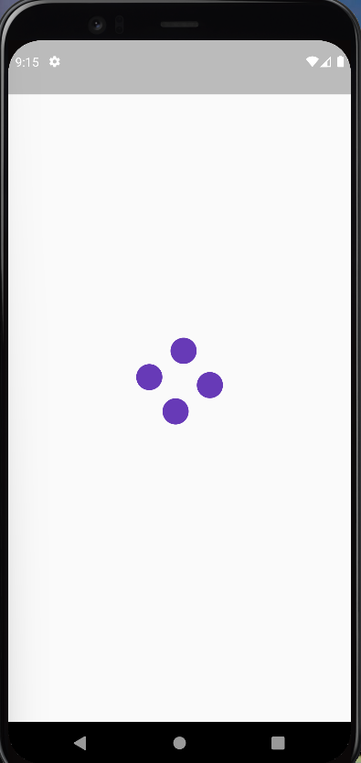 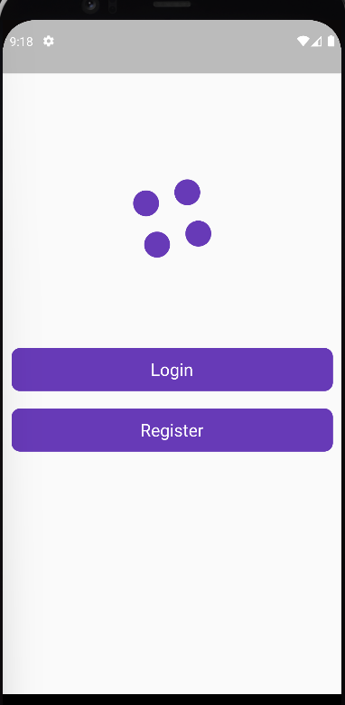 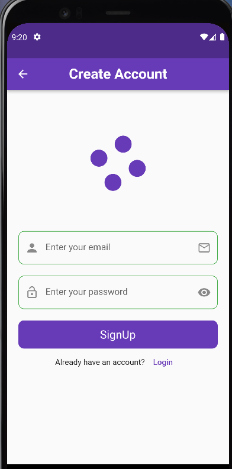 
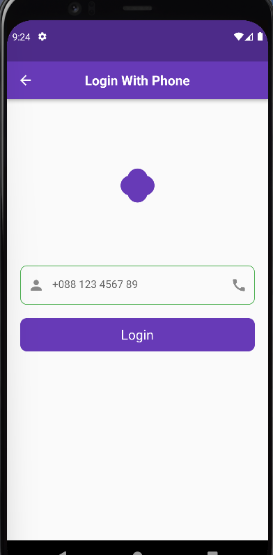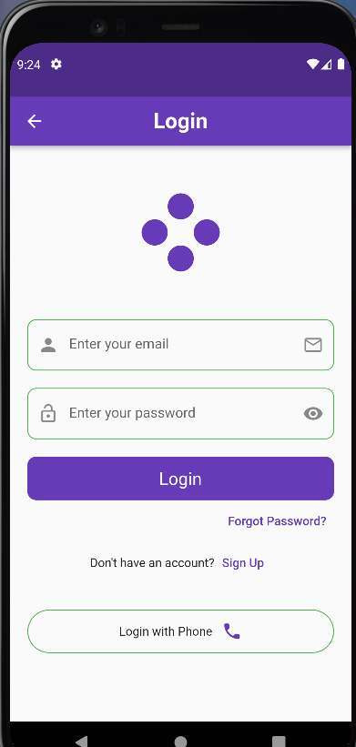 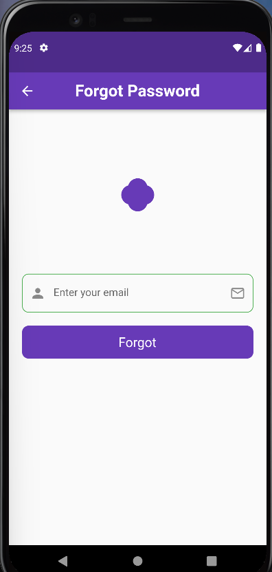 
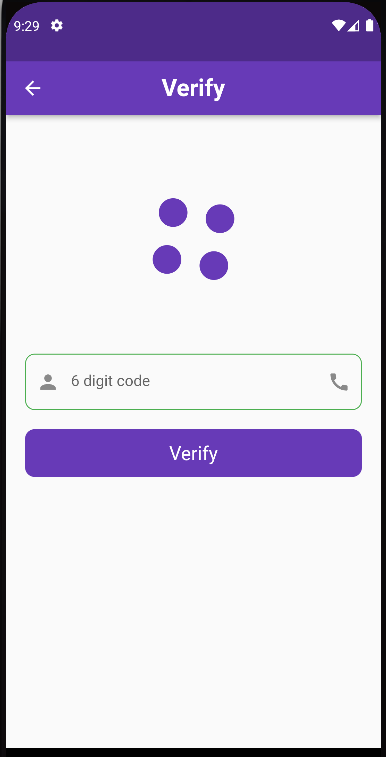  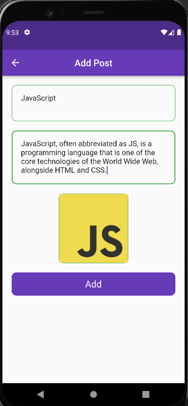 
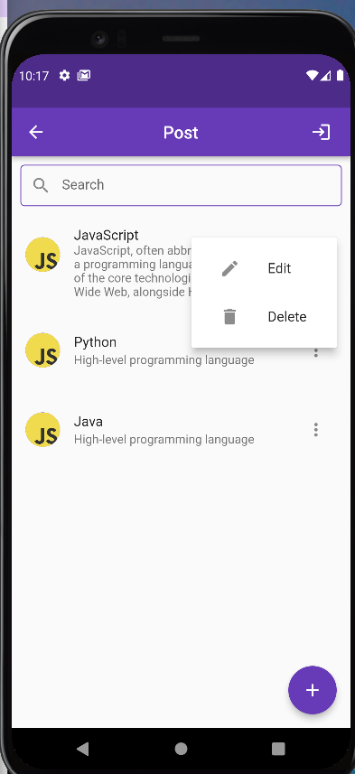 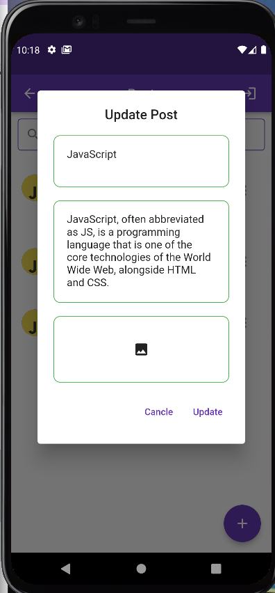 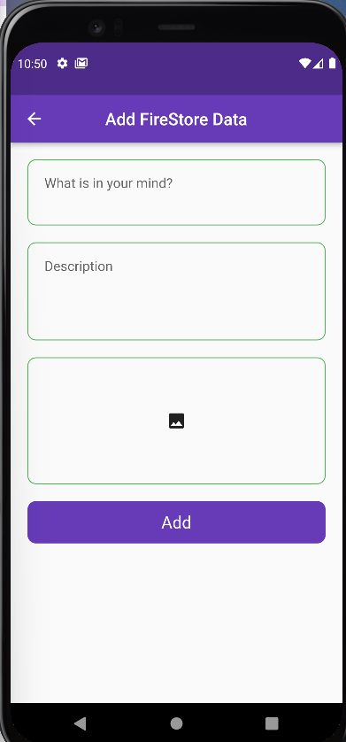  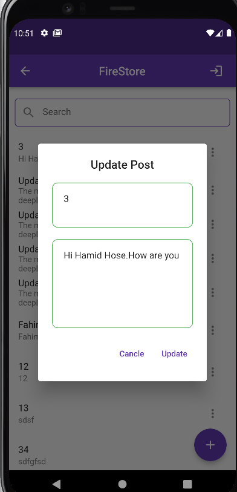 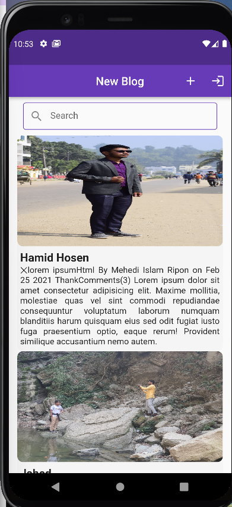  

### [APK](https://github.com/hamidhosen42/Flutter-Firebase/blob/main/app-release.apk)
### dependencies:
1. firebase_core: ^1.10.0
2. firebase_auth: ^3.2.0
3. firebase_database: ^8.1.0
4. cloud_firestore: ^3.1.0
5. firebase_storage:
6. flutter_loading_animation_kit: 
7. flutter_screenutil: 
8. fluttertoast: 
9. firebase_database: 
10.image_picker:

### Topic :
1. Firebase Integration in Flutter Project
2. Firebase Authentication
3. Cloud FireStore (CRUD)
4. Real-Time Database (CRUD)
5. Firebase Storage
6. Push Notification

#### Firebase Integration in Flutter Project:
Firebase provides a wide range of services for mobile and web applications. To integrate Firebase into your Flutter project, you'll need to add the necessary Firebase packages as dependencies in your pubspec.yaml file. These packages include firebase_core (for initializing Firebase), firebase_auth (for authentication), cloud_firestore (for Cloud Firestore), and firebase_storage (for Firebase Storage). Additionally, you'll need to configure your project with the Firebase project credentials by adding the appropriate configuration files (google-services.json for Android and GoogleService-Info.plist for iOS) to the respective project directories.

```
a. Set up a new Flutter project or open an existing project.
b. Create a new Firebase project on the Firebase console (https://console.firebase.google.com/) and follow the on-screen instructions.
c. Add the necessary Flutter Firebase dependencies to your pubspec.yaml file:

dependencies:
  firebase_core: ^1.6.0
  firebase_auth: ^3.2.0
  cloud_firestore: ^3.1.0
  firebase_storage: ^10.2.0

d. Run flutter pub get to fetch the dependencies.
e. Configure your Flutter project with the Firebase project credentials by adding the google-services.json file (for Android) and the GoogleService-Info.plist file (for iOS) to the respective project directories.
f. Initialize Firebase in your Flutter project by adding the following code in your main.dart file:

import 'package:firebase_core/firebase_core.dart';

void main() async {
  WidgetsFlutterBinding.ensureInitialized();
  await Firebase.initializeApp();
  runApp(MyApp());
}
```

#### Firebase Authentication:
Firebase Authentication provides various methods for user authentication, including email/password authentication, phone number authentication, and social media authentication (e.g., Google, Facebook, Twitter). You can choose the authentication methods that suit your app's requirements and implement them using the Firebase Authentication API. Firebase Authentication also offers features like user management, password reset, and account linking.

```
a. Make sure you have integrated Firebase in your Flutter project (as mentioned in the previous steps).
b. Add the firebase_auth dependency to your pubspec.yaml file (if you haven't already) and run flutter pub get.
c. Use the Firebase Authentication API to implement the desired authentication flows in your app, such as email/password authentication, phone number authentication, social media authentication, etc.

Here's an example of email/password authentication:

import 'package:firebase_auth/firebase_auth.dart';

// Sign up with email and password
void signUp(String email, String password) async {
  try {
    UserCredential userCredential = await FirebaseAuth.instance.createUserWithEmailAndPassword(
      email: email,
      password: password,
    );
    // User successfully signed up
    User user = userCredential.user;
    // ...
  } catch (e) {
    // Error occurred during sign up
    print(e.toString());
  }
}

// Sign in with email and password
void signIn(String email, String password) async {
  try {
    UserCredential userCredential = await FirebaseAuth.instance.signInWithEmailAndPassword(
      email: email,
      password: password,
    );
    // User successfully signed in
    User user = userCredential.user;
    // ...
  } catch (e) {
    // Error occurred during sign in
    print(e.toString());
  }
}

// Sign out
void signOut() async {
  await FirebaseAuth.instance.signOut();
}
```

#### Cloud Firestore (CRUD):
Cloud Firestore is a flexible, scalable, and real-time NoSQL database offered by Firebase. It organizes data into collections and documents. With Cloud Firestore, you can perform CRUD (Create, Read, Update, Delete) operations on your data. You can create a new document, read its data, update fields within a document, and delete documents. You can also query the database based on various criteria to retrieve specific data or perform complex searches.

```
Certainly! Cloud Firestore is a NoSQL document-oriented database provided by Firebase. It offers real-time data synchronization and offline capabilities, making it suitable for building responsive and collaborative applications. Here's a breakdown of CRUD operations in Cloud Firestore:

Create a Document:
To create a document in Cloud Firestore, you need to specify the collection where the document will reside and provide the data for the document. The document is identified by an automatically generated document ID or a custom ID you assign. Here's an example:

import 'package:cloud_firestore/cloud_firestore.dart';

void createDocument() {
  FirebaseFirestore.instance
      .collection('users')
      .doc('user1')
      .set({
        'name': 'John Doe',
        'email': 'john@example.com',
      })
      .then((value) => print('Document created successfully'))
      .catchError((error) => print('Failed to create document: $error'));
}


Read a Document:
To read a document from Cloud Firestore, you can retrieve it by specifying the collection and document ID. The data within the document can be accessed using the data() method. Here's an example:

import 'package:cloud_firestore/cloud_firestore.dart';

void readDocument() {
  FirebaseFirestore.instance
      .collection('users')
      .doc('user1')
      .get()
      .then((DocumentSnapshot documentSnapshot) {
        if (documentSnapshot.exists) {
          print(documentSnapshot.data());
        } else {
          print('Document does not exist');
        }
      })
      .catchError((error) => print('Failed to read document: $error'));
}


Update a Document:
To update a document in Cloud Firestore, you can use the update() method to modify specific fields within the document. Here's an example:

import 'package:cloud_firestore/cloud_firestore.dart';

void updateDocument() {
  FirebaseFirestore.instance
      .collection('users')
      .doc('user1')
      .update({'name': 'Jane Doe'})
      .then((value) => print('Document updated successfully'))
      .catchError((error) => print('Failed to update document: $error'));
}


Delete a Document:
To delete a document from Cloud Firestore, you can use the delete() method. Here's an example:

import 'package:cloud_firestore/cloud_firestore.dart';

void deleteDocument() {
  FirebaseFirestore.instance
      .collection('users')
      .doc('user1')
      .delete()
      .then((value) => print('Document deleted successfully'))
      .catchError((error) => print('Failed to delete document: $error'));
}

```

#### Real-Time Database (CRUD):
Firebase Realtime Database is a NoSQL, cloud-hosted database that allows you to store and synchronize data in real-time across clients. It uses a JSON-like structure to store data. With the Realtime Database, you can perform CRUD operations by manipulating the database's references. You can create or update data, read data at a specific location, listen for real-time updates, and delete data. The Realtime Database is particularly useful for building real-time collaborative applications, chat apps, and other applications that require synchronized data.

```
Real-Time Database (CRUD):
Firebase Realtime Database is a cloud-hosted NoSQL database that allows you to store and sync data in real-time. Here's an example of performing CRUD operations in the Realtime Database:
import 'package:firebase_database/firebase_database.dart';

// Create or update data
void setData() {
  final databaseRef = FirebaseDatabase.instance.reference();
  databaseRef.child('users/user1').set({
    'name': 'John Doe',
    'email': 'john@example.com',
  });
}

// Read data
void getData() {
  final databaseRef = FirebaseDatabase.instance.reference();
  databaseRef.child('users/user1').once().then((DataSnapshot snapshot) {
    if (snapshot.value != null) {
      print(snapshot.value);
    }
  });
}

// Update data
void updateData() {
  final databaseRef = FirebaseDatabase.instance.reference();
  databaseRef.child('users/user1').update({
    'name': 'Jane Doe',
  });
}

// Delete data
void deleteData() {
  final databaseRef = FirebaseDatabase.instance.reference();
  databaseRef.child('users/user1').remove();
}


```

#### Firebase Storage:
Firebase Storage provides secure file uploads and downloads for your app's user-generated content. It allows you to store various types of files, such as images, videos, audio files, and more. With Firebase Storage, you can upload files from the client-side and retrieve their download URLs for later use. You can also manage files, set access control rules, and monitor the upload/download progress.

```
Firebase Storage:
Firebase Storage is a cloud storage solution provided by Firebase for storing and serving user-generated content. Here's an example of uploading and downloading files using Firebase Storage in Flutter:

import 'package:firebase_storage/firebase_storage.dart';
import 'package:path/path.dart' as Path;

// Upload a file
void uploadFile() async {
  File file = File('path/to/file.jpg');
  String fileName = Path.basename(file.path);
  Reference storageRef = FirebaseStorage.instance.ref().child(fileName);
  UploadTask uploadTask = storageRef.putFile(file);

  await uploadTask.whenComplete(() => print('File uploaded'));
}

// Download a file
void downloadFile() async {
  String fileName = 'file.jpg';
  Reference storageRef = FirebaseStorage.instance.ref().child(fileName);
  String downloadURL = await storageRef.getDownloadURL();
  // Use the downloadURL to download the file
  // ...
}

```

#### Push Notification:
Firebase Cloud Messaging (FCM) enables you to send push notifications to your app users. Push notifications are a powerful tool for engaging users and delivering important updates. With FCM, you can send notifications to individual devices, groups of devices, or topics. You can customize the notification payload, handle notification actions, and even send data payloads along with notifications. FCM supports both Android and iOS platforms and provides reliable delivery of notifications to your app users.


```
Push Notification:
Firebase Cloud Messaging (FCM) enables you to send push notifications to users of your Flutter app. Here's an example of sending a push notification using Firebase Cloud Messaging:

import 'package:firebase_messaging/firebase_messaging.dart';

// Configure Firebase Cloud Messaging
void configureFCM() {
  FirebaseMessaging messaging = FirebaseMessaging.instance;
  // Configure FCM settings, such as handling incoming messages, defining notification channels, etc.
  // ...
}

// Send a push notification
void sendPushNotification() async {
  String serverToken = 'YOUR_SERVER_TOKEN';
  String deviceToken = 'RECIPIENT_DEVICE_TOKEN';

  await http.post(
    Uri.parse('https://fcm.googleapis.com/fcm/send'),
    headers: <String, String>{
      'Content-Type': 'application/json',
      'Authorization': 'key=$serverToken',
    },
    body: jsonEncode(<String, dynamic>{
      'notification': <String, dynamic>{
        'body': 'Hello, this is a push notification!',
        'title': 'Flutter Firebase App',
      },
      'priority': 'high',
      'data': <String, dynamic>{
        'click_action': 'FLUTTER_NOTIFICATION_CLICK',
        'id': '1',
        'status': 'done',
      },
      'to': deviceToken,
    }),
  );
}


```

### Real Time data base Permission denied in firbase:
 ```
{
  "rules": {
    ".read": true,
    ".write": true
  }
}
 ```

SHA1 KeyWord commend =keytool -list -v -keystore C:\Users\user\.android\debug.keystore -alias androiddebugkey -storepass android -keypass android

android->app->build.grad=
1. multiDexEnabled true
2. implementation 'com.android.support:multidex:1.0.3'
