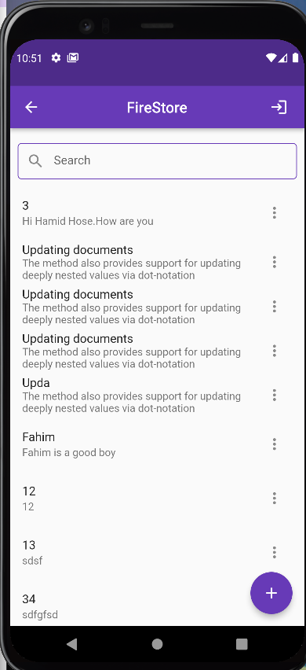

### [Firebase](https://console.firebase.google.com/u/0/project/flutter-firebase-1e704/authentication/users)

### Screenshots
   
  
   
       

### [APK](https://github.com/hamidhosen42/Flutter-Firebase/blob/main/app-release.apk)
### dependencies:
1. firebase_core: ^1.10.0
2. firebase_auth: ^3.2.0
3. firebase_database: ^8.1.0
4. cloud_firestore: ^3.1.0
5. firebase_storage:
6. flutter_loading_animation_kit: 
7. flutter_screenutil: 
8. fluttertoast: 
9. firebase_database: 
10.image_picker:

### Topic :
1. Firebase Integration in Flutter Project
2. Firebase Authentication
3. Cloud FireStore (CRUD)
4. Real-Time Database (CRUD)
5. Firebase Storage
6. Push Notification

#### Firebase Integration in Flutter Project:
Firebase provides a wide range of services for mobile and web applications. To integrate Firebase into your Flutter project, you'll need to add the necessary Firebase packages as dependencies in your pubspec.yaml file. These packages include firebase_core (for initializing Firebase), firebase_auth (for authentication), cloud_firestore (for Cloud Firestore), and firebase_storage (for Firebase Storage). Additionally, you'll need to configure your project with the Firebase project credentials by adding the appropriate configuration files (google-services.json for Android and GoogleService-Info.plist for iOS) to the respective project directories.

#### Firebase Authentication:
Firebase Authentication provides various methods for user authentication, including email/password authentication, phone number authentication, and social media authentication (e.g., Google, Facebook, Twitter). You can choose the authentication methods that suit your app's requirements and implement them using the Firebase Authentication API. Firebase Authentication also offers features like user management, password reset, and account linking.

#### Cloud Firestore (CRUD):
Cloud Firestore is a flexible, scalable, and real-time NoSQL database offered by Firebase. It organizes data into collections and documents. With Cloud Firestore, you can perform CRUD (Create, Read, Update, Delete) operations on your data. You can create a new document, read its data, update fields within a document, and delete documents. You can also query the database based on various criteria to retrieve specific data or perform complex searches.

#### Real-Time Database (CRUD):
Firebase Realtime Database is a NoSQL, cloud-hosted database that allows you to store and synchronize data in real-time across clients. It uses a JSON-like structure to store data. With the Realtime Database, you can perform CRUD operations by manipulating the database's references. You can create or update data, read data at a specific location, listen for real-time updates, and delete data. The Realtime Database is particularly useful for building real-time collaborative applications, chat apps, and other applications that require synchronized data.

#### Firebase Storage:
Firebase Storage provides secure file uploads and downloads for your app's user-generated content. It allows you to store various types of files, such as images, videos, audio files, and more. With Firebase Storage, you can upload files from the client-side and retrieve their download URLs for later use. You can also manage files, set access control rules, and monitor the upload/download progress.

#### Push Notification:
Firebase Cloud Messaging (FCM) enables you to send push notifications to your app users. Push notifications are a powerful tool for engaging users and delivering important updates. With FCM, you can send notifications to individual devices, groups of devices, or topics. You can customize the notification payload, handle notification actions, and even send data payloads along with notifications. FCM supports both Android and iOS platforms and provides reliable delivery of notifications to your app users.

### Real Time data base Permission denied in firbase:
 ```
{
  "rules": {
    ".read": true,
    ".write": true
  }
}
 ```

SHA1 KeyWord commend =keytool -list -v -keystore C:\Users\user\.android\debug.keystore -alias androiddebugkey -storepass android -keypass android

android->app->build.grad=
1. multiDexEnabled true
2. implementation 'com.android.support:multidex:1.0.3'
