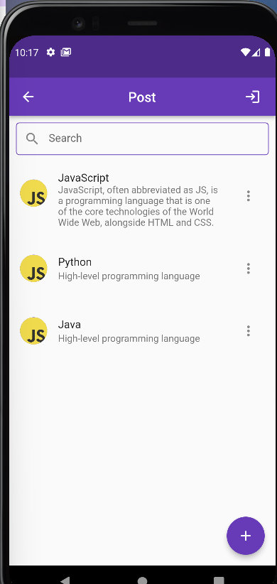
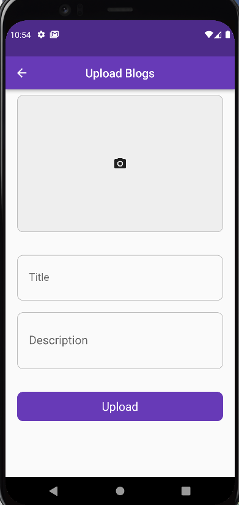

### [Firebase](https://console.firebase.google.com/u/0/project/flutter-firebase-1e704/authentication/users)

### Screenshots
   
  
   
       

### [APK](https://github.com/hamidhosen42/Flutter-Firebase/blob/main/app-release.apk)
### dependencies:
1. firebase_core: ^1.10.0
2. firebase_auth: ^3.2.0
3. firebase_database: ^8.1.0
4. cloud_firestore: ^3.1.0
5. firebase_storage:
6. flutter_loading_animation_kit: 
7. flutter_screenutil: 
8. fluttertoast: 
9. firebase_database: 
10.image_picker: 

### Real Time data base Permission denied in firbase:
 ```
{
  "rules": {
    ".read": true,
    ".write": true
  }
}
 ```

SHA1 KeyWord commend =keytool -list -v -keystore C:\Users\user\.android\debug.keystore -alias androiddebugkey -storepass android -keypass android

android->app->build.grad=
1. multiDexEnabled true
2. implementation 'com.android.support:multidex:1.0.3'
